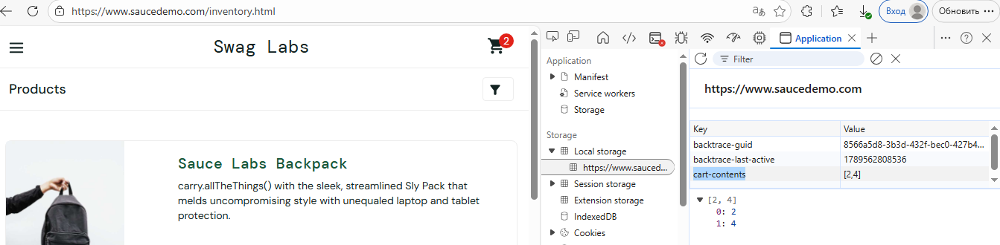

# BUG-001:  Каталог товаров в корзине сохраняется при смене пользователя

**Серьёзность (Severity):** High  
**Приоритет (Priority):** High  
**Окружение:**  
- ОС: Windows 10  
- Браузер: Microsoft Edge 146.0.3856.84
- Сайт: [SauceDemo](https://www.saucedemo.com/)

**Предусловия:**  
- Открыта главная страница saucedemo.com.  
- Пользователь не авторизован.  

**Шаги воспроизведения:**  
1. Авторизоваться как `standard_user` / `secret_sauce`.  
2. Добавить любые 2 товара в корзину.  
3. Убедиться, что счётчик корзины показывает 2.  
4. Открыть DevTools → Application → Local Storage → `https://www.saucedemo.com`.  
   - Обнаружен ключ `cart-contents` с массивом ID добавленных товаров.  
5. Выйти из системы (Logout).  
6. Авторизоваться как `problem_user` / `secret_sauce`.  
7. Посмотреть на иконку корзины и открыть её.  

**Ожидаемый результат:**  
- Корзина нового пользователя пуста.  
- Счётчик корзины равен 0.  
- В localStorage нет данных о товарах предыдущего пользователя.  

**Фактический результат:**  
- Счётчик корзины показывает 2.  
- В корзине отображаются товары, добавленные под `standard_user`.  
- В localStorage сохраняется массив `cart-contents` с ID этих товаров.  

**Вложения:**  
- Скриншот 1: корзина после входа под `problem_user` (товары на месте).  
- Скриншот 2: DevTools → Local Storage с ключом `cart-contents`. 
 

**Дополнительно:**  
Баг воспроизводится стабильно. Очистка localStorage вручную убирает товары из корзины или при помощи команды localStorage.removeItem("cart-contents").