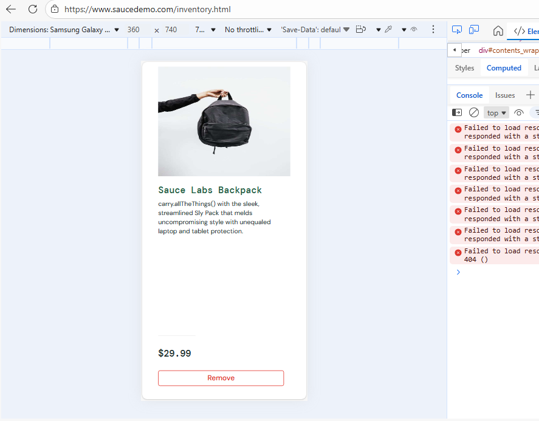
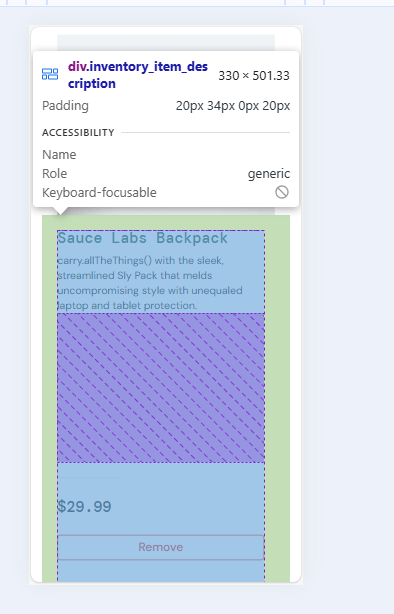

# BUG-002:  Некорректное отображение карточек товаров на мобильном устройстве

**Серьёзность (Severity):** Minor  
**Приоритет (Priority):** Medium 
**Окружение:**  
- ОС: Windows 10  
- Браузер: Microsoft Edge 146.0.3856.84
- Эмуляция устройства: Samsung Galaxy S8+ через DevTools (360×740, DPR 4)
- Сайт: [SauceDemo](https://www.saucedemo.com/)

**Предусловия:**  
- Пользователь авторизован на странице.
- Открыта страница инвентаря: https://www.saucedemo.com/inventory.html.

**Шаги воспроизведения:**  
1. Авторизоваться как `standard_user` / `secret_sauce`.  
2. Убедиться, что открылась страница инвентаря.
3. Открыть DevTools (F12) -> Включить эмуляцию устройства (Toogle Device Emulation) -> Выбрать устройство Samsung Galaxy S8+.
4. Прокрутить список товаров и проверить отображение карточек.

**Ожидаемый результат:**  
- Верстка карточек товаров на мобильном устройстве отображается корректно

**Фактический результат:**  
- При эмуляции на карточки товаров отображаются с нарушением верстки

**Вложения:**  
- Два вложенных скриншота, на которых показаны проблемы с версткой карточки конкретных товаров

